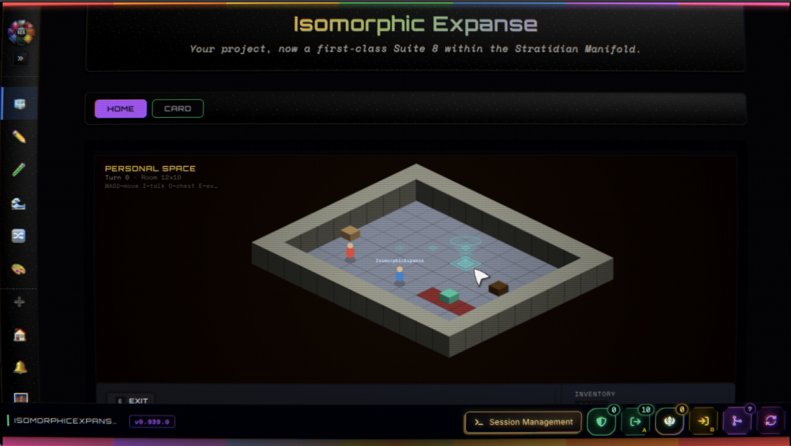
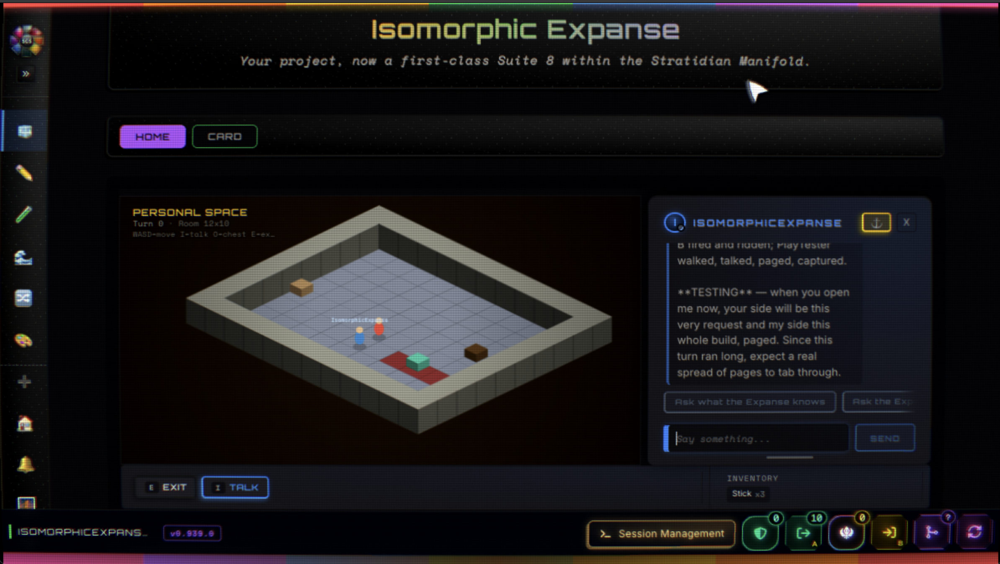

# IsomorphicExpanse

**A Suite Cascade Protocol (SCP) instance** — a self-contained ARIOS window, born from the
SCS-Bridge template and grown through its own Cascade cycles.

> **Active development · proof-of-concept form factor.** Surfaces, suites, and structure are
> all in motion; the update circuit carries this app forward with each SCS-Bridge release.

## What this is

An SCP is a Stratimux Concept Program, a Suite Cascade Protocol, and a means of containing a
domain by representing it as a Service that Contains a Problem. Concretely: a local Vue +
Stratimux window conducted by [SCS-Bridge](https://www.npmjs.com/package/scs-bridge), where
working surfaces — Suite 8s — each hold their own page, their own sessions, and their own
memory. IsomorphicExpanse is one such instance: the first released through the bridge's own
Release pane.

## Structure

```
SCP/
├── src/concepts/       — the Stratimux concept space (StratiDECK client + server)
│                         cadmium · gitm · huirth · isomorphicExpanse · pewter ·
│                         scp · scsBridge · strativerse · muxonomy · …
├── Cascades/
│   ├── 8_SUITES/       — the Suite 8 working surfaces:
│   │                     Cadmium Researcher · Entourage Forge · Fresh Slate ·
│   │                     Frontier DoubleCheck · Graphite Scribe · Pewter Tessera ·
│   │                     Template Suite 8
│   └── Extended/       — the living working memory (Diamond + Onyx documents)
├── scripts/            — update-circuit tools
├── public/             — static assets
├── scp.config.json     — the SCP's declared identity + its applied template counter
└── package.json
```

## The living memory

This repository deliberately retains its working documents in history. Each Suite 8 keeps a
**Diamond** (the plan — what aspires to be done) paired with an **Onyx** (the trajectory —
what was actually done, diagnosed cycle by cycle). Read
`SCP/Cascades/Extended/Cadmium Researcher/ONYX-TIER-0.md` for the first completed research
arc — the history of `Hello, World!`, traced to primary sources. The history is part of the
artifact.

## Pass-Through Interaction with Agents

The feature this SCP exists to prove: **driving agents from game worlds** — a proof of
concept for play and work running on the same clock.



The Isomorphic Expanse is a world the visitor and its guide build together. The guide is
inside the world — the sole inhabitant — and the dialog window over its head is its voice,
riding a **real Claude Code session**. Recorded from its own working Diamond, the means:

- **The Bound Anchor Chat** — talking to the guide reaches a real session; replies come back
  brief and in character, while deep work lands in its terminal.
- **Tool Approval in Chat** — a held permission gate becomes answerable rows right in the
  dialog: the agent's real approval surface, passed through the game.
- **Live Feed Ack** — while the guide works, the typing indicator names the tool it is
  actually running, held between tools.
- **One turn per step** — clicking a distant tile traces a route and walks it one deliberate
  turn at a time, around people and furniture; the turn you take in the game is the turn the
  agent takes in the work.
- **The Agent-Authored Menu** — the guide writes its own doors (`menu.json`); they appear in
  the world and survive reloads.
- **Self-Knowledge** — the guide carries Skills describing its own architecture, and revises
  them as the space changes.



The dialog is not a chat skin over an API — it is the session itself, passed through: its
voice, its tool feed, and its approval gate all surface inside the world while the work
feeds the world the visitor is standing in.

## Running it

IsomorphicExpanse installs and runs under SCS-Bridge — it is not a standalone npm package.

```bash
npm i -g scs-bridge
cd your-workspace
scs
```

Then install this SCP through the bridge's SCP Management surface (paste its Configuration
JSON manifest, or install from this repository's URL). The bridge boots it, serves it, and
keeps it current through the GitM Update circuit — template advances merge without touching
this app's own work, and its identity is preserved by rule.

## Status

Proof of concept, actively developed. Expect motion.

## License

[GPL-3.0](SCP/LICENSE)
